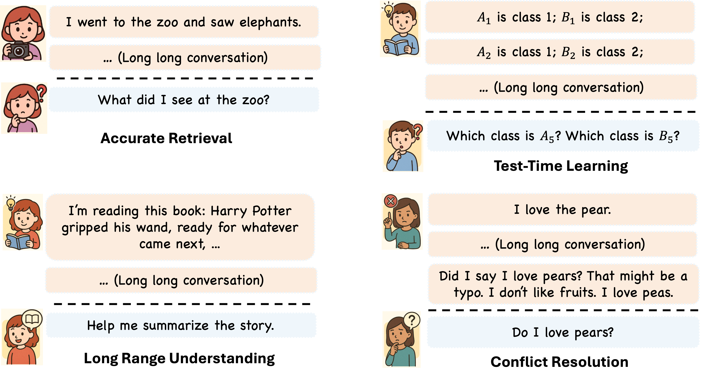

# ⚙️ MemoryAgentBench: Evaluating Memory in LLM Agents via Incremental Multi-Turn Interactions

[Yuanzhe Hu](https://hust-ai-hyz.github.io), [Yu Wang](https://yuwang.us), [Julian McAuley](https://cseweb.ucsd.edu/~jmcauley/).

This project benchmarks agents with memory capabilities. Follow the steps below to set up your environment and install dependencies. 

[Full paper](https://arxiv.org/abs/2507.05257)


## 🧠 LongMemEval Overview

Four Core Competencies for Evaluation:
* Accurate Retrieval (AR)

* Test-Time Learning (TTL)

* Long-Range Understanding (LRU)

* Conflict Resolution (CR)




We collected and reformulated data from previous benchmarks and datasets. All data is split into chunks to simulate real multi-turn interaction scenarios—just like your daily conversations with an AI assistant. We also newly constructed two datasets **EventQA** and **FactConsolidation**.

Notably, the team adopted a "inject once, query multiple times" design philosophy—one long text corresponds to multiple questions, significantly improving evaluation efficiency.

## 🚧 Update
- [x] (Sep. 28th, 2025)  
    We publish a new version of our paper. 

- [x] (Aug. 5th, 2025)  
    We optimized the ```template.py``` for better usage.

- [x] (July 22th, 2025)  
    We updated the ```Readme.md``` and release the code for ```longmemeval``` and ```infbench_sum```. They are needed to evaluate by using ```gpt-4o``` as a judge. 

    We change the ```uuid``` into ```qa_pair_id``` in our code.

    We updated the huggingface dataset slightly. 

- [x] (July 7th, 2025) 
    We released the code for reproducing the main experiment. 


- TODO List ✍️ .
    
    <del> [x] New Dataset in Long Range Understanding (LRU). </del>

    [] Leaderboard website for our benchmark.

    [] The code framework with separated front-end and back-end is easier to integrate with custom memory agents.

**🌟 More details (such as datasets collection) coming soon! 🌟**


## 🚀 Quick Setup

### 1. Create a Conda Environment

It’s recommended to use a dedicated conda environment for reproducibility:
```
conda create --name MABench python=3.10.16
```

### 2. Install Python Dependencies

```
pip install torch
pip install -r requirements.txt
pip install "numpy<2"
```
We did not include the `hipporag` in `requirements.txt` since the current version of `hipporag` will cause some conflicts on pacakge version. You can create another environment with hipporag instead.  

Sometimes you can try to supplement the lacked packages for `cognee` and `letta`. If you met some package related errors after installing `requirements.txt`. 
```
pip install letta
pip uninstall letta   
pip install cognee
pip uninstall cognee
```

## 📥 Data Download & API Settings

To use this project, you need to download the processed data files and place them in the correct directory.

### 1. Download the Data from HuggingFace 🤗 

- HuggingFace dataset [link](https://huggingface.co/datasets/ai-hyz/MemoryAgentBench). It can be automatically downloaded if you run the code directly. 

- Do not forget the `entity2id.json` for Movie Recommendation task.


### 2. Environment Variable Settings

To run this project, you need to configure your API keys and model settings in a `.env` file at the project root.

Create a `.env` file and add the following content, replacing the placeholder values with your actual API keys:

#### OpenAI API Keys

```
OPENAI_API_KEY= ###your_openai_api_key
```

#### Settings for Cognee
```
LLM_MODEL=gpt-4o-mini
LLM_API_KEY=  ###your_api_key
```

#### Other API Keys
```
Anthropic_API_KEY= ###your_anthropic_api
Google_API_KEY=    ###your_google_api
```

## 🏃‍♂️ Run Evaluation

Follow these steps to evaluate the benchmarking agent:


### Run Example Evaluation Command

You can run an evaluation using the following example command:

#### Long Context Agents
```
bash bash_files/eniac/run_memagent_longcontext.sh
```
- `--agent_config`: Path to the agent/model configuration file.
- `--dataset_config`: Path to the dataset configuration file.

#### Rag Agents and Agentic Memory Methods

```
bash bash_files/eniac/run_memagent_rag_agents.sh
```
#### Ablation Study for Chunk Size
```
bash bash_files/eniac/run_memagent_rag_agents_chunksize.sh
```

Remember that `hipporag (2.0.0a3)` reuqires `openai==1.58.1`, which may cause some latest OpenAI models could not be used in same environment. 


### Run LLM-based Metric Evaluation 

You can run an evaluation using the following example python files, you also need to set the configs

#### LongmemEval

```
python llm_based_eval/longmem_qa_evaluate.py
```

#### InfBench Summarization 
```
python llm_based_eval/summarization_evaluate.py
```

## 👍 Acknowledgement 

We thank the open-source code and datasets from RULER, InfBench, HELMET and LongmemEval.

## 📝 Citation 

We would appreciate it if you could cite the following paper if you found the repository useful for your work:
```
@article{hu2025evaluating,
  title={Evaluating Memory in LLM Agents via Incremental Multi-Turn Interactions},
  author={Hu, Yuanzhe and Wang, Yu and McAuley, Julian},
  journal={arXiv preprint arXiv:2507.05257},
  year={2025}
}
```
